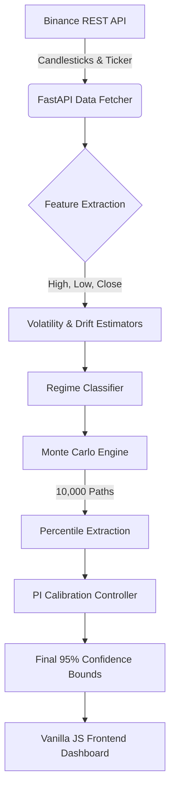

# 🧠 BTC Quant Forecaster: Model Architecture & Algorithms

This document outlines the core quantitative architecture, mathematical models, and algorithmic pipelines powering the BTC Quant Forecaster. The system is designed to generate highly calibrated 95% confidence intervals for the next 1-hour Bitcoin price using advanced statistical and stochastic methods.

---

## 🏗️ 1. High-Level System Architecture

The application is built on a real-time, asynchronous, walk-forward architecture to ensure zero data leakage and instantaneous reaction to market movements.

---

## 🧮 2. The Algorithmic Pipeline

The quantitative engine (`model/forecaster.py`) operates in a sequential pipeline for every new data point.

### Step A: Feature Engineering & Volatility Modeling
Bitcoin's volatility clusters tightly but is prone to sudden shocks. To capture this accurately, the model blends three volatility estimators:

1. **EWMA (Exponentially Weighted Moving Average)**:
   - Tracks the variance of log returns with heavier weights on recent observations. 
   - Uses a *Fast (12-period)* and *Slow (26-period)* span to identify volatility momentum.
2. **Parkinson Volatility**:
   - Uses High and Low prices instead of Close-to-Close returns.
   - **Formula**: $\sigma_{park} = \sqrt{\frac{1}{4 \ln(2)} \frac{1}{N} \sum \left(\ln\frac{H_t}{L_t}\right)^2}$
   - *Why?* It provides a much more efficient estimate of intra-bar chop and turbulence.
3. **ATR (Average True Range)**:
   - Used to detect absolute price expansion and gap risks.

### Step B: Regime Classification
The system categorizes the current market environment to dynamically re-weight risk parameters.
- **Calm**: Low EWMA ratio, low ATR. (Prioritizes long-term Slow EWMA and Parkinson).
- **Volatile**: Fast EWMA is significantly higher than Slow EWMA, or ATR is spiking. (Prioritizes Fast EWMA and widens the structural jump probabilities).
- **Medium**: Standard operating conditions.

### Step C: Drift Estimation (Momentum)
Instead of assuming a static mean or relying entirely on a lagging rolling average, the drift ($\mu$) is estimated using an **Exponential Moving Average (EMA)** of recent returns. 
- A slight **Shrinkage Factor** ($\lambda = 0.10$) is applied to pull the drift slightly toward zero, preventing the model from over-extrapolating extreme parabolic trends.

---

## 🎲 3. Stochastic Modeling: Jump-Diffusion Monte Carlo

The core of the forecasting engine uses a hybrid Monte Carlo simulation generating 10,000 potential future paths. 

To map Bitcoin's extreme "fat tails", a standard Normal distribution or even a basic Student-t distribution is insufficient. We use a **Jump-Diffusion Process**:

1. **Continuous Diffusion (Student-t)**:
   - The degree of freedom ($\nu$) is dynamically estimated based on the **excess kurtosis** of the recent lookback window.
   - If kurtosis is high (fat tails), $\nu$ drops to its minimum (2.5). 
2. **Poisson Jumps**:
   - Random, sudden shocks (flash crashes/spikes) are injected into the paths.
   - The probability of a jump ($\lambda_{jump}$) increases dynamically if the system enters a "Volatile" regime.
   - Jump magnitudes are drawn from a normal distribution with a standard deviation $2.5\times$ larger than the base volatility.

**Simulated Price Equation**:
$$ P_{t+1} = P_t \times \exp \left( \mu + \sigma \cdot t_{\nu} + \sum_{i=1}^{N_t} J_i \right) $$
*(Where $N_t \sim Poisson(\lambda)$ and $J_i \sim \mathcal{N}(0, \sigma_{jump}^2)$)*

3. **Bootstrap Resampling**:
   - 50% of the simulated paths are generated using the parametric Jump-Diffusion model above.
   - The other 50% are generated by sampling actual, historical log-returns from the asset's recent history, ensuring the model respects the exact empirical distribution of the current market structure.

---

## 🎯 4. Online Adaptive Calibration (PI Controller)

Because market dynamics shift, static models eventually degrade in accuracy. The Forecaster uses a **Proportional-Integral (PI) Controller** to dynamically tune the width of the confidence interval, ensuring it rigorously maintains a **95% empirical coverage rate** out-of-sample.

1. **Error Tracking**:
   - The system tracks an Exponential Moving Average (EMA) of its recent hit rate (1 if the actual price lands inside the interval, 0 if it breaches).
   - $Error = Coverage_{EMA} - 0.95$
2. **Control Logic**:
   - **Proportional Term ($K_p$)**: Reacts aggressively to immediate deviations from the 95% target.
   - **Integral Term ($K_i$)**: Accumulates historical errors to fix sustained, long-term biases and prevents the interval from permanently sitting at 92% or 98%.
3. **Adjustment**:
   - The PI output alters the `calib_factor`, a multiplier applied directly to the simulated volatility parameters. If coverage drops to 90%, the controller smoothly widens the bounds until coverage returns to exactly 95%.

---

## 📏 5. Validation & Scoring (Winkler Score)

To objectively measure the model's accuracy, it uses the **Winkler Interval Score**.

A model can easily achieve 95% coverage by simply predicting infinitely wide bounds $[$0, $\infty]$. The Winkler score penalizes models for wide bounds, forcing the PI controller and Volatility estimators to find the *narrowest possible interval* that still achieves 95% coverage.

**Winkler Score Formula**:
$$ S = (U - L) + \frac{2}{\alpha}(L - X)\mathbb{1}_{X < L} + \frac{2}{\alpha}(X - U)\mathbb{1}_{X > U} $$
- **Width Penalty**: $(U - L)$ rewards tight, sharp intervals.
- **Breach Penalty**: Massive penalty if the actual price ($X$) falls outside the bounds.

By optimizing for the lowest Winkler score through the Walk-Forward Backtester, the system guarantees efficient, actionable risk modeling.
